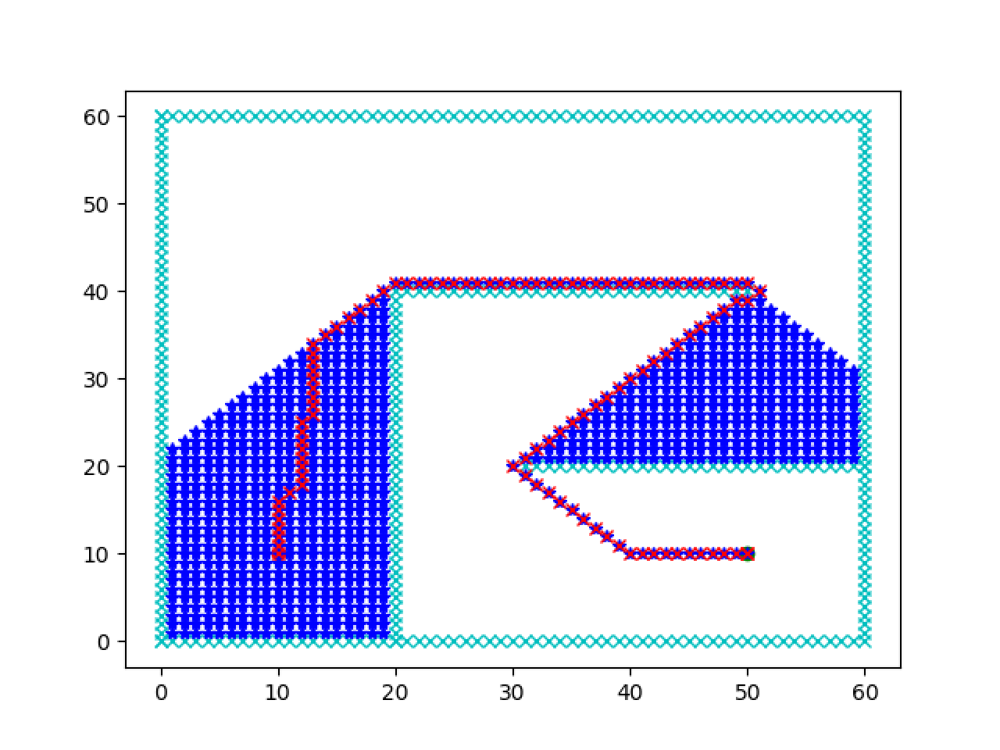

# Dijkstra implementation with Python

Wikipedia explanation: [Dijkstra](https://en.wikipedia.org/wiki/Dijkstra%27s_algorithm)

Path planning: F(n) = H

Heuristics Function: Manhattan, Euclidean or Chebyshev

## Exploration

- less time complexity
