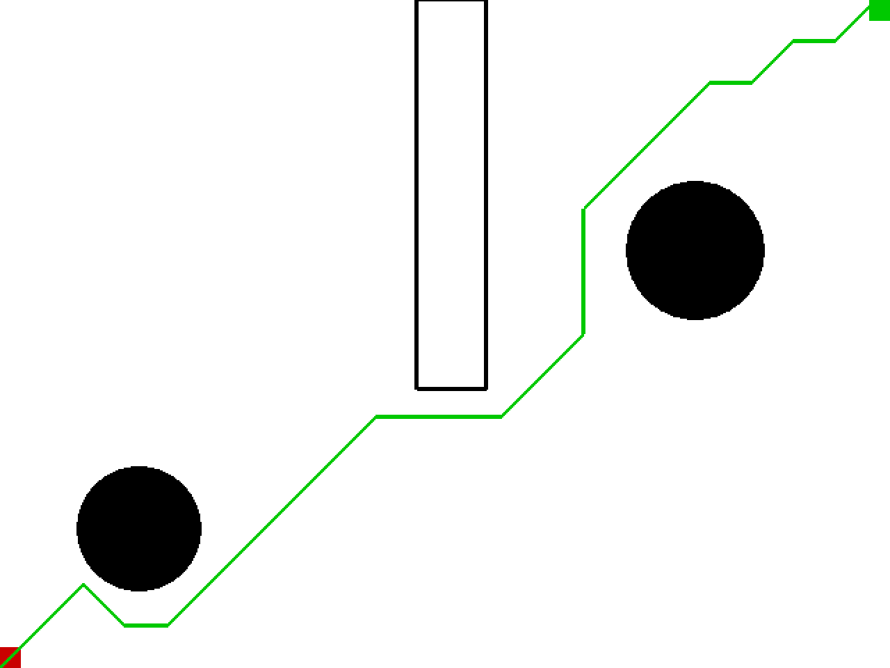

# Robotics-Notebook

## Path Planning

### A*

### Dijkstra

### RRT

*Reference*:

[Rapidly-Exploring Random Trees: A New Tool for Path Planning](http://citeseerx.ist.psu.edu/viewdoc/summary?doi=10.1.1.35.1853)

### RRT*

*Reference*:

[Sampling-based algorithms for optimal motion planning](https://journals.sagepub.com/doi/abs/10.1177/0278364911406761)

### Qlearning

