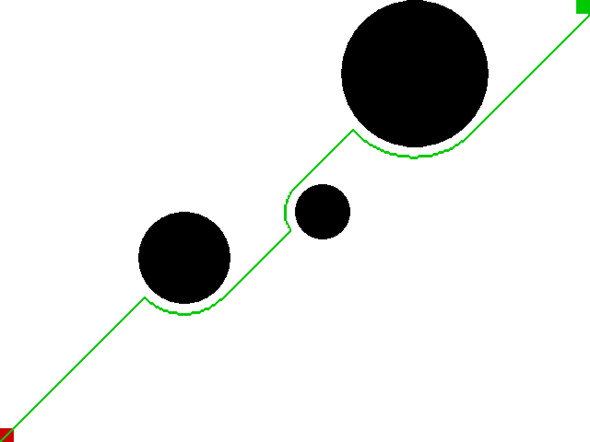

# Robotics-Notebook

- [Path Planning](#Path-Planning)
  - [Dijkstra](#Dijkstra)
  - [A*](#AStar)
  - [Potential Field](#Potential-Field)
  - [RRT](#RRT)
  - [RRT*](#RRTStar)
  - [Qlearning](#Qlearning)

## Path Planning

### Dijkstra

*Reference*:

[Dijkstra's algorithm - Wikipedia](https://en.wikipedia.org/wiki/Dijkstra%27s_algorithm)

### A* 

*Reference*:

[A* search algorithm - Wikipedia](https://en.wikipedia.org/wiki/A*_search_algorithm)

### Potential Field

*Reference*:

[Robotic Motion Planning: Potential Functions](https://www.cs.cmu.edu/~motionplanning/lecture/Chap4-Potential-Field_howie.pdf)

### RRT

*Reference*:

[Rapidly-Exploring Random Trees: A New Tool for Path Planning](http://citeseerx.ist.psu.edu/viewdoc/summary?doi=10.1.1.35.1853)

### RRT* 

*Reference*:

[Sampling-based algorithms for optimal motion planning](https://journals.sagepub.com/doi/abs/10.1177/0278364911406761)

### Qlearning

*Reference*:

[**Path Planning with qlearning**](<https://github.com/0aqz0/path-planning-with-qlearning>)

