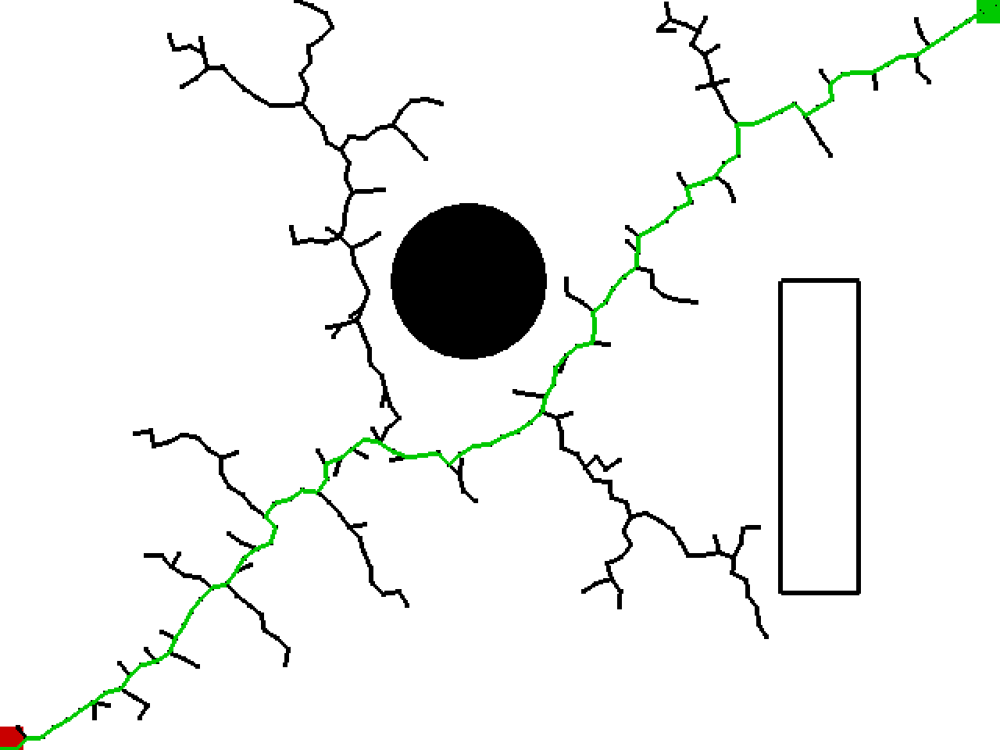
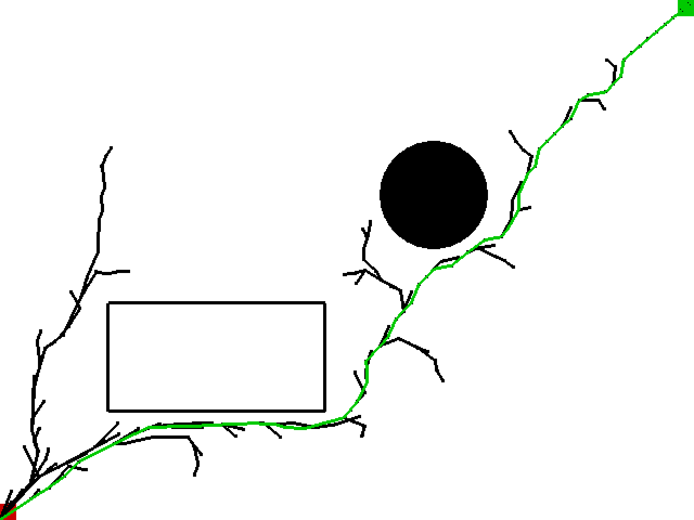

# Robotics-Notebook

## Path Planning

### A*

### Dijkstra

### RRT

Reference:

[Rapidly-Exploring Random Trees: A New Tool for Path Planning](http://citeseerx.ist.psu.edu/viewdoc/summary?doi=10.1.1.35.1853)

### RRT*

### Qlearning

